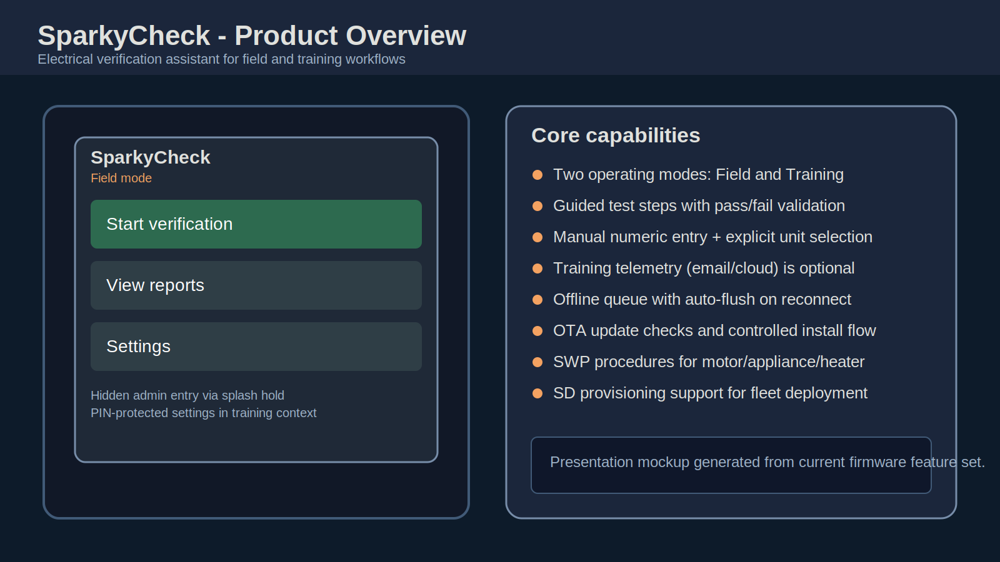
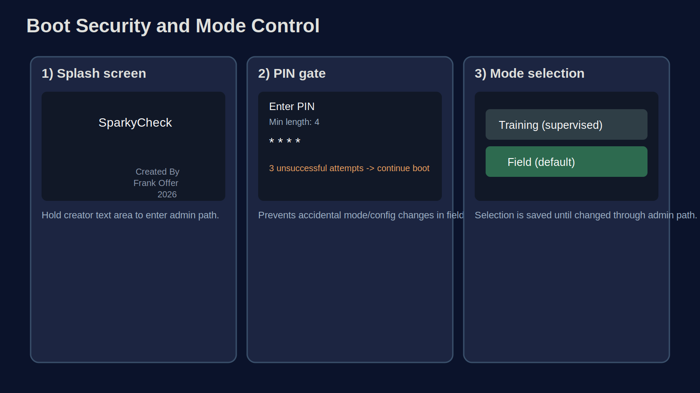
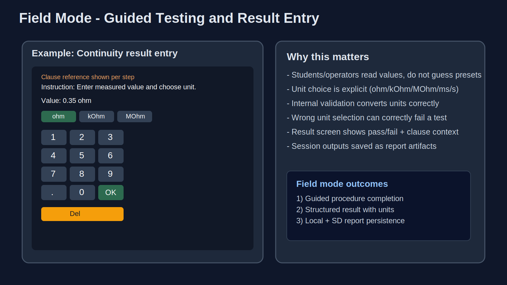
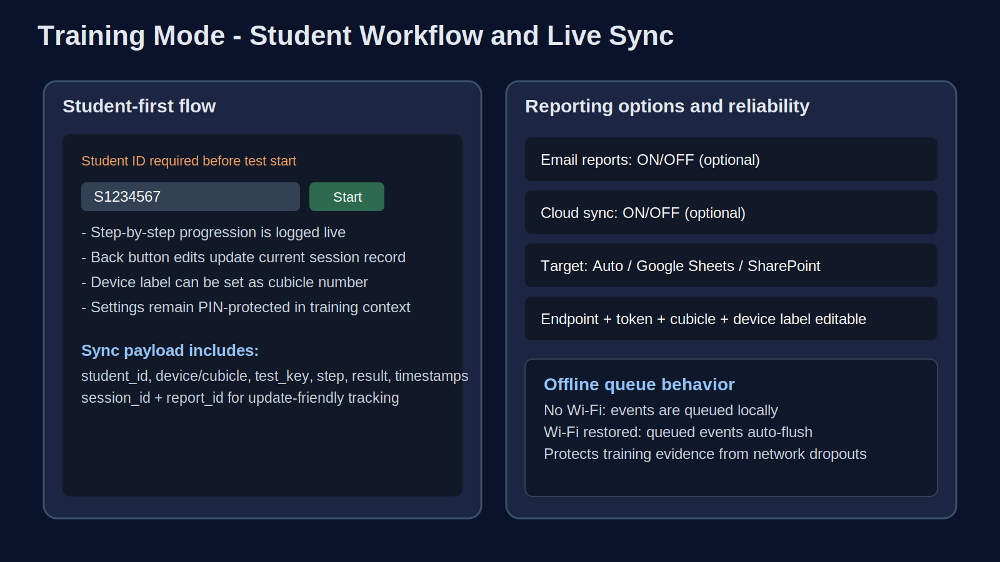
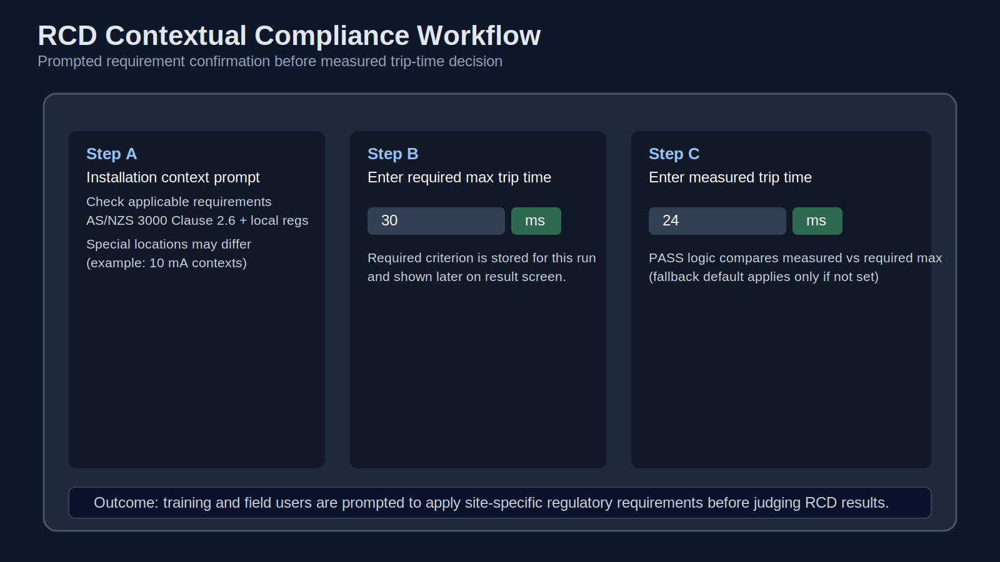
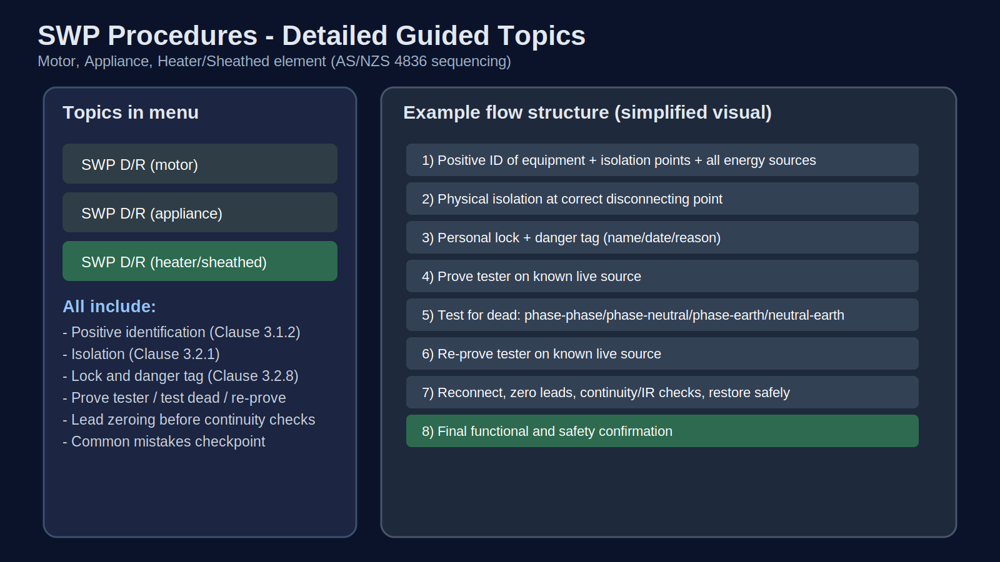
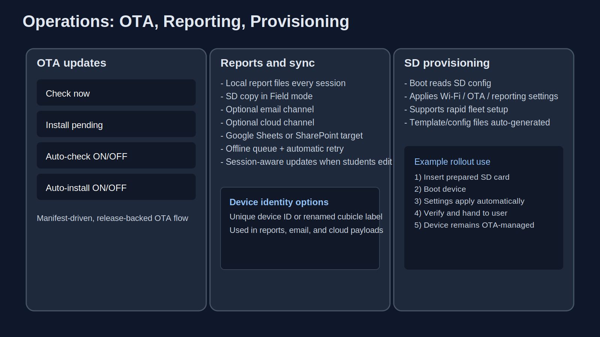

# SparkyCheck Mockup Pack (Presentation Ready)

This pack provides static visual mockups you can use in slides or handouts.
All files are SVG (vector), so they scale cleanly for presentations.

## Included mockups

1. `docs/mockups/01-product-overview.svg`
2. `docs/mockups/02-boot-security-and-modes.svg`
3. `docs/mockups/03-field-mode-guided-testing.svg`
4. `docs/mockups/04-training-mode-and-live-sync.svg`
5. `docs/mockups/05-rcd-contextual-compliance.svg`
6. `docs/mockups/06-swp-procedures-detailed.svg`
7. `docs/mockups/07-ota-reports-and-provisioning.svg`

## Inline preview references

## Quick usage

- Drag each SVG directly into PowerPoint, Google Slides, or Keynote.
- Keep aspect ratio locked when resizing.
- Optional: export each SVG to PNG from a browser if your slide tool prefers PNG.

## What these cover

- Field mode and Training mode behavior
- Hidden admin boot gesture + PIN protection
- Guided test flow with numeric value and unit entry
- Student ID capture and training telemetry options
- Context-driven RCD requirement workflow
- SWP disconnect/reconnect guides for:
  - Motor
  - Appliance
  - Heater/sheathed element
- OTA updates, SD provisioning, offline queue, and reporting channels

