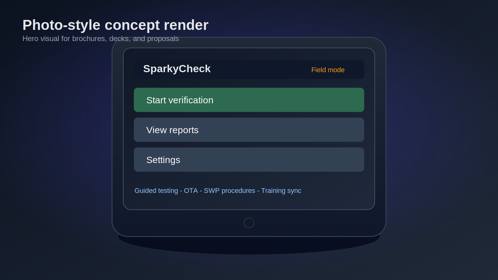
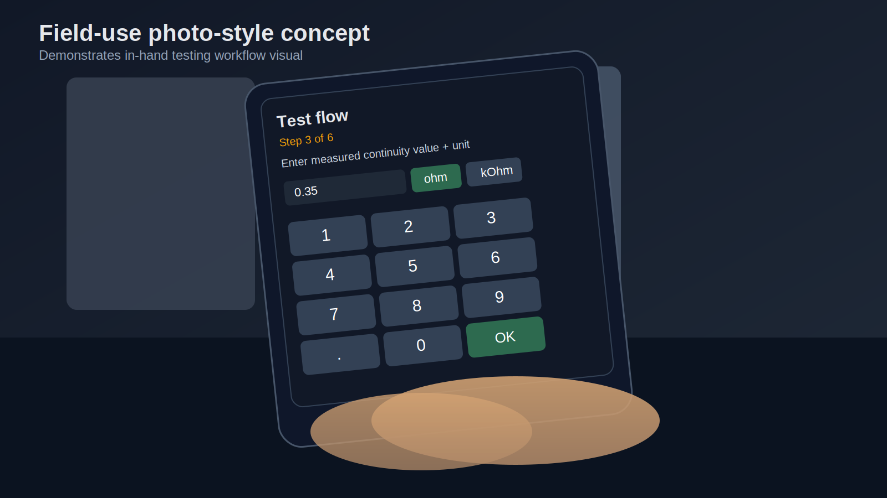
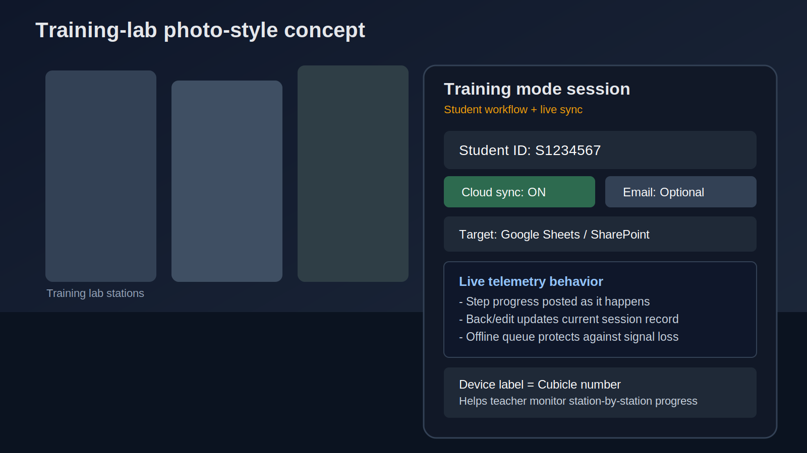
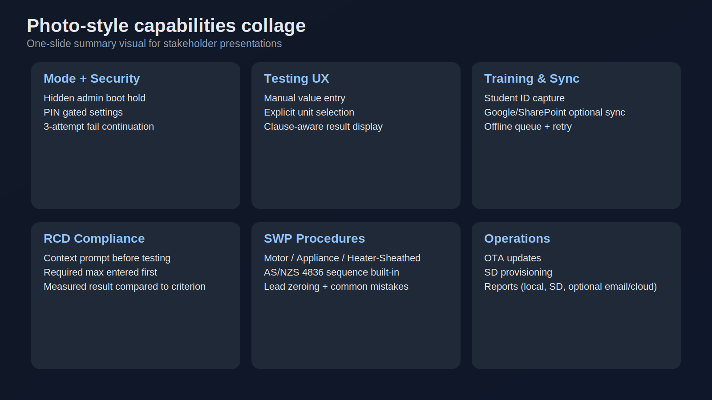

# SparkyCheck Photo-Style Concept Mockups

These are **photo-style concept renders** (not real camera photos), designed for presentations where you want a more realistic product look.

## Files

1. `docs/mockups-photo/01-device-hero-photo-style.svg`
2. `docs/mockups-photo/02-field-use-photo-style.svg`
3. `docs/mockups-photo/03-training-lab-photo-style.svg`
4. `docs/mockups-photo/04-capabilities-collage-photo-style.svg`

## Notes

- These are intentionally styled to look like product photos.
- They are concept visuals, not physical-device photography.
- SVG format keeps them crisp for slides and print.

## Inline preview references

## Quick use

- Insert directly into slides.
- Add your brand/logo overlay if needed.
- Pair with the original UI mockup pack for feature detail.

